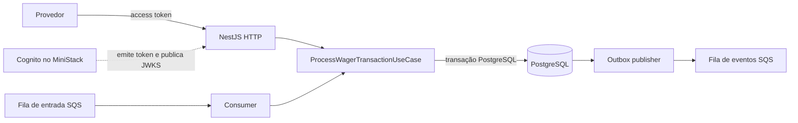
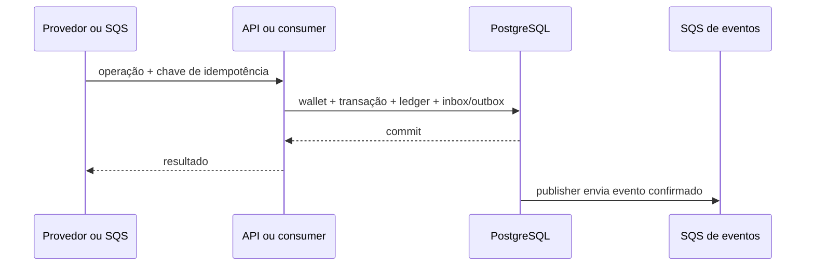

# Arquitetura

## Visão geral

O backend recebe transações por HTTP ou por uma fila SQS. Escolhi fazer os dois
caminhos chegarem ao mesmo caso de uso: assim, uma aposta enviada pela API e a
mesma aposta recebida pelo worker passam pelas mesmas regras financeiras.

O código está dividido por responsabilidade: domínio para regras financeiras;
aplicação para os casos de uso; infraestrutura para PostgreSQL, SQS e métricas;
e apresentação para HTTP, DTOs, autenticação e documentação OpenAPI. Essa
separação mantém o domínio fora dos detalhes de NestJS e AWS, sem criar uma
camada extra para cada operação.

## Consistência financeira

### Precisão e ledger

Dinheiro entra e sai da API como string decimal e é armazenado em colunas
`numeric`, não em ponto flutuante. Isso evita erros de arredondamento em
operações financeiras. O modelo aceita moeda no valor, mas o escopo atual
processa BRL; operações com moeda incompatível são rejeitadas.

A wallet mantém um saldo materializado para consultas rápidas. Cada mudança de
saldo grava também um lançamento imutável no ledger, com direção, valor e
saldo antes/depois. `BET` debita, `WIN` credita, `LOSS` registra o resultado
sem movimentar o saldo e `REFUND`/`ROLLBACK` precisam apontar para uma
transação válida. Uma abertura com saldo positivo gera um crédito `OPENING`.
Há no máximo uma wallet por jogador e moeda, e o saldo não pode ficar negativo.

Escolhi guardar o saldo atual e o histórico, em vez de calcular cada consulta
somando todos os lançamentos. Isso torna a leitura simples e rápida, mas cria
dois registros que precisam permanecer consistentes. Por isso, saldo,
transação e ledger são persistidos na mesma transação SQL, e há uma rota de
reconciliação que compara o saldo com a reconstrução pelo ledger. A
reconciliação informa divergências; não corrige dinheiro automaticamente.

### Concorrência

Uma wallet pode receber apostas simultâneas em instâncias diferentes. Antes de
validar e aplicar o saldo, o processamento bloqueia a linha da wallet com
`SELECT ... FOR UPDATE`. Locks advisory transacionais também ordenam o uso de
chaves de idempotência e identificadores externos; constraints únicas no
PostgreSQL protegem o dado como última barreira.

Esse lock pessimista reduz paralelismo quando muitas requisições disputam a
mesma wallet. Preferi esse custo a aceitar *lost updates* ou saldo negativo. O
banco ainda processa wallets diferentes em paralelo. A versão da wallet é
mantida como dado de estado, mas a estratégia de concorrência implementada é
locking pessimista, não optimistic locking.

### Idempotência

O cliente envia `Idempotency-Key`, recomendado no formato
`<providerId>:<externalTransactionId>`. A aplicação salva a chave e um hash
canônico dos campos de negócio. Uma repetição com a mesma chave e payload
retorna o resultado original; a mesma chave com outro payload é conflito, não
um novo processamento.

Essa persistência é necessária porque retries podem chegar a outra instância
ou depois de um restart. A contrapartida é manter as chaves e hashes no banco
como parte do modelo operacional, em vez de depender de um cache temporário.

## SQS, inbox e outbox

As mensagens de entrada têm entrega *at-least-once*. O consumer grava o recibo
da inbox junto com o processamento financeiro e só confirma a mensagem depois
do commit PostgreSQL. Uma redelivery encontra o recibo persistido e não repete
efeitos. Erros transitórios recebem retry limitado; mensagens malformadas ou
conflitantes são encaminhadas para a DLQ.

Quando uma transação produz um evento, a aplicação grava a outbox na mesma
transação SQL que atualiza wallet, ledger e transação. O publisher envia os
eventos confirmados para SQS e registra a publicação. Assim, uma falha antes
do commit não publica um evento sobre uma operação que não aconteceu.

PostgreSQL e SQS não participam de uma transação distribuída. Se o SQS aceitar
uma mensagem e o publisher cair antes de marcar a outbox, o evento poderá ser
publicado de novo. O `eventId` permanece estável para que consumidores possam
deduplicar. A fila FIFO ajuda com ordenação e deduplicação de curto prazo, mas
não substitui a idempotência persistida no banco.

## Autenticação e identidade do provedor

Integrei um Identity Provider em vez de criar autenticação própria. No
desenvolvimento, o Cognito do MiniStack emite access tokens; em produção, a
mesma fronteira deve apontar para um Cognito gerenciado ou outro IdP compatível.
O provedor mantém seu client secret e o usa para obter um token OAuth
`client_credentials`. A API recebe apenas o token.

O guard valida assinatura RS256 via JWKS, issuer, expiração e
`token_use=access`. Depois associa o `client_id` do token ao `providerId`
configurado. Um token de ID não é aceito. O mesmo `providerId` é conferido no
corpo e nas rotas que recebem esse campo, impedindo que um app client consulte
transações identificadas como pertencentes a outro provedor.

Optei por provisionar User Pool e app clients fora do startup. Isso evita que
a API crie identidades implicitamente e deixa cada ambiente controlar seus
provedores. A configuração é carregada quando uma rota protegida é acessada;
sem configuração, a API continua viva, mas recusa a chamada protegida.

Há um detalhe local do MiniStack: a rota JWKS funciona pelo loopback, mas a
mesma chamada pelo hostname `ministack` é interpretada como uma rota S3 e
retorna `NoSuchBucket`. Para contornar isso sem enfraquecer a validação, API e
MiniStack compartilham o namespace de rede no Compose, e a API consulta
`http://localhost:4566`. A porta HTTP da API é publicada no serviço MiniStack.
É uma particularidade da topologia local, não uma recomendação para produção.

O modelo atual identifica o provedor, mas ainda não associa uma wallet a um
provedor. Portanto, a autenticação não equivale a uma regra de propriedade
para as rotas de wallet. Essa autorização precisa ser modelada antes de expor
essas rotas em um contexto multi-tenant real. Health checks e Swagger ficam
públicos; mensagens da fila são consideradas um canal interno confiável e
continuam sujeitas às validações de domínio.

## Organização do código e tecnologias

| Parte | Responsabilidade |
| --- | --- |
| `src/domain/` | Money, wallet, transação, ledger e invariantes |
| `src/application/` | Casos de uso e coordenação das operações |
| `src/infrastructure/` | MikroORM/PostgreSQL, migrations, SQS, inbox/outbox e métricas |
| `src/presentation/http/` | Controllers, DTOs, autenticação, validação e OpenAPI |
| `src/shared/` | Erros, hash, JSON canônico e contratos compartilhados |

- **Bun 1.x** atende ao runtime e ao gerenciamento de dependências pedidos no
  plano. `bun.lock` e `--frozen-lockfile` deixam as instalações reproduzíveis.
- **NestJS e TypeScript** compõem a aplicação e validam os contratos HTTP.
- **PostgreSQL e MikroORM** dão transações, constraints e locks no mesmo lugar
  onde os dados financeiros são persistidos.
- **MiniStack** fornece Cognito e SQS no ambiente local. Essa conveniência
  reduz a quantidade de serviços para iniciar, mas não substitui testes de
  configuração e operação nos serviços AWS gerenciados.
- **Docker Compose** coordena API/worker, PostgreSQL e MiniStack. No ambiente
  local, compartilhar a rede da API com o MiniStack resolve o acesso ao JWKS,
  ao custo de publicar a porta da API pelo serviço MiniStack.

## API e respostas

As rotas protegidas e seus schemas completos estão no Swagger em `/docs`.
Entre as rotas principais estão:

- `POST /wallets` e `GET /wallets/:walletId`;
- `GET /wallets/:walletId/ledger?limit=50&cursor=...`;
- `POST /wallets/:walletId/reconciliation`;
- `POST /wagering/transactions`;
- `GET /wagering/transactions/:transactionId`;
- `GET /providers/:providerId/wagering/transactions/:externalTransactionId`.

A API distingue validação inválida, conflito de idempotência, rejeição de
negócio, referência pendente e falha transitória. Uma rejeição de negócio não
altera o saldo. Referências ainda não recebidas podem deixar uma transação
pendente, mas o caso de uso de reprocessamento ainda não está ligado a um
agendador periódico.

## Observabilidade e testes

Os logs de processamento são estruturados e carregam IDs de correlação. Não
registram payloads financeiros completos, saldos, credenciais ou chaves de
idempotência. As métricas cobrem transações por status, duplicatas, retries,
DLQ, conflitos de lock, latência de processamento, atraso da outbox e
divergências na reconciliação. `/health/live` verifica o processo e
`/health/ready` consulta banco e MiniStack.

Os testes unitários cobrem regras de domínio e idempotência; a suíte HTTP
verifica validação, status e OpenAPI; os testes de integração usam PostgreSQL
e MiniStack reais em containers para persistência, filas, retries e redelivery.
O runner `bun run test:report` gera relatório com as etapas executadas e as que
não puderam ser preparadas.

O cenário de concorrência usa processos Bun independentes e pools
PostgreSQL separados, mas ainda não sobe três containers de aplicação. O
pipeline também não simula upgrades sequenciais a partir de todas as versões
históricas de migrations nem reinicia toda a topologia em cada cenário. Essas
diferenças são importantes: os testes cobrem concorrência entre processos e
recuperação do worker, mas não devem ser descritos como prova de operação em
cluster de containers.

Os passos para iniciar e exercitar o projeto estão em
[README.md](./README.md).
